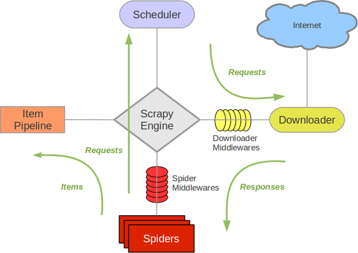

## A spider demo using by Golang

## 单机版
单机版实现参考 Python 的 Scrapy 框架，盗个图

主要有这几个模块
- Engine:负责各个模块间的数据流交互，生成 Request 传递给 Scheduler 模块.
- Scheduler: Url 的去重，过滤，分发带爬取 Request 到 Spider 模块中.
- Spider: 进行网页的爬取和解析，解析后的 Item 传递给 ItemPipeline 处理， Request 传递给 Engine 模块.
- Item Pipeline: 对解析结果进行过滤，持久化处理
+ 详细介绍参考 [Python Scrapy框架](https://segmentfault.com/a/1190000012041391)

## 分布式
分布式实现参考这篇文章[Scrapy分布式实现](https://segmentfault.com/a/1190000014333162) 这篇文章 papapa 说了一堆，说的简单一点就是
* 将单机版的 Engine 和 Scheduler 两个模块抽取出来整合成一个新的模块，这个模块就是 Redis.
* Master 和 Slave 进程通过 Redis 消息队列进行通信(对应 Redis 的 List 数据结构).
* Master 进程通过 Redis lpush 产生待爬取 Request.
* Slave 进程通过 Redis brpop 获取 Request 进行网页爬取和解析.
或者用 rpush/blpop 这个组合也可以，这样就实现了简单的分布式了.

本项目长期维护，求喷，求喷！！！